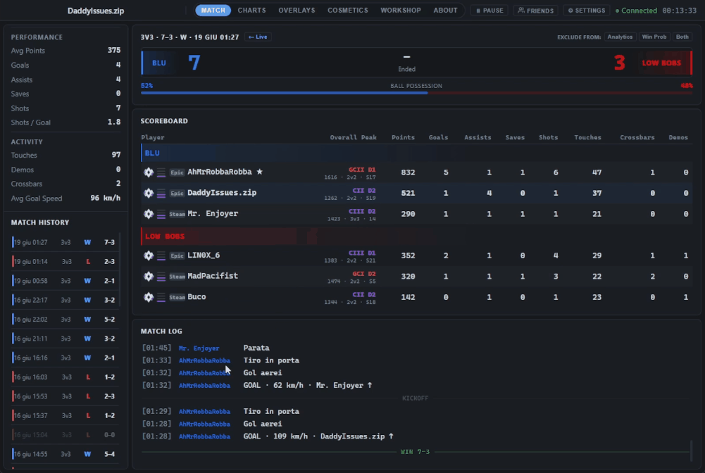
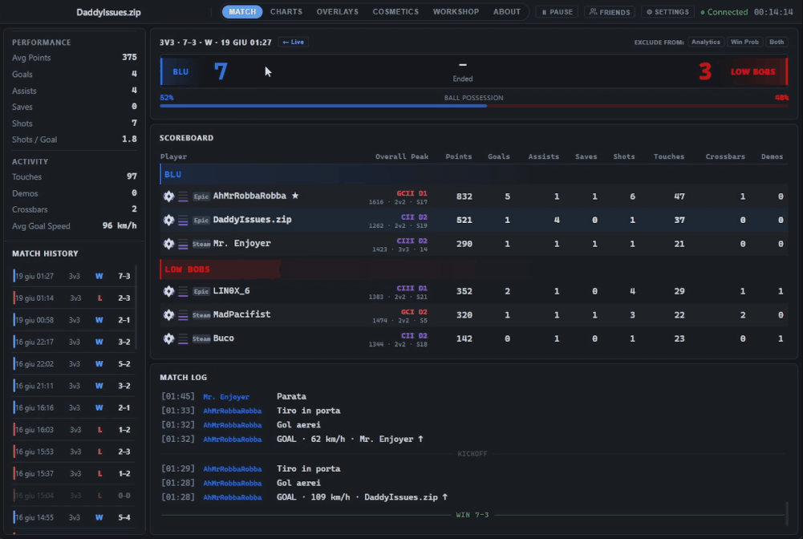
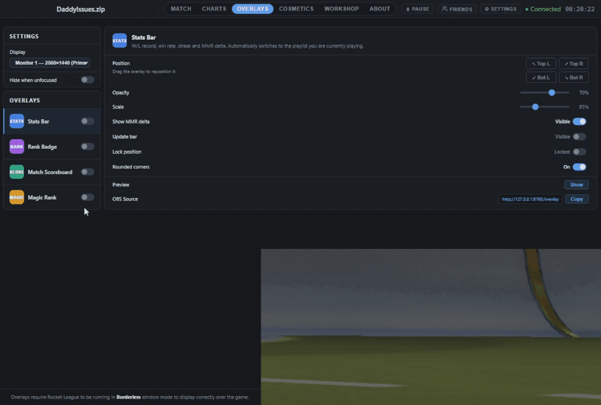
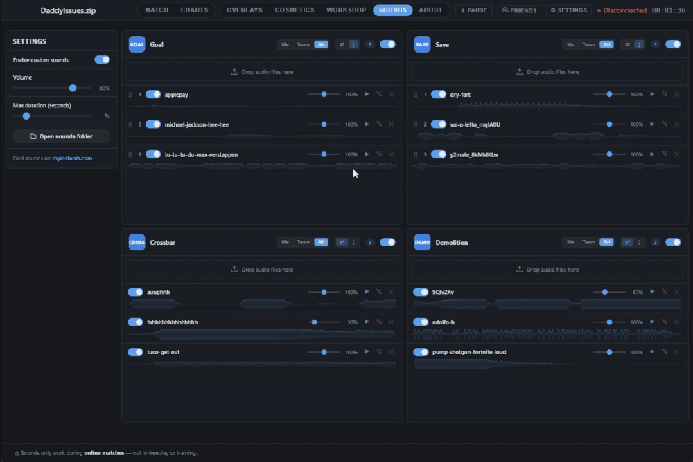

# Bakkboard

**The complete Rocket League toolkit. The best BakkesMod alternative in 2026.**

Bakkboard runs alongside Rocket League and tracks everything that happens in your matches — live stats, win probability, MMR trends, overlays, cosmetics swap, workshop maps, custom sounds and more. Open it before a session and it takes care of the rest.

---

## Download

**[→ Download the latest Bakkboard.exe from Releases](https://github.com/lorislorenzetti/bakkboard/releases/latest)**

No installation required. Double-click and play.

---

## Features

### ⚡ Live Match
- Scoreboard with goals, assists, saves, shots, touches, crossbars and demos
- Live ball possession bar
- Event log with goal speeds and hard hits
- Tracker.gg rank, peak rank and platform badge for every player — including those who left mid-match

### 👥 Player Tracking
- Track anyone from the scoreboard
- Encounter badges with teammate vs opponent history on hover
- Friends panel: compare, hide or untrack per player
- Open any player's Tracker.gg profile directly inside the app

### 📈 Charts & Analytics
- Local: W/L timeline, play-style trends and shot tracking with custom date ranges
- Tracker.gg: rating progression, lifetime stats, avg performance and play-style tables
- Switch between your profile and any tracked player in one click

### 🖥️ Overlays
- **Stats Bar** — matches played, W/L, win rate, streak and MMR delta. Switches playlist automatically
- **Rank Badge** — current rank, division and MMR. Switches playlist automatically
- **Match Scoreboard** — both teams, scores and rank icons during active matches
- **Magic Rank** — rank icons overlaid on the in-game scoreboard. Requires one-time calibration
- All overlays are positionable, scalable and opacity-adjustable
- Optional auto-hide when Rocket League loses focus

### 🎨 Cosmetics Swap
- Apply custom decals, wheels and boosts via UPK file patching
- Select car body first — each body keeps its own decal slot
- Originals backed up and restored in one click
- No runtime injection — files are swapped at rest, not during gameplay

### 🗺️ Workshop Maps
- Browse, search and load maps into Free Play in one click
- Sort by downloads, rating, name, size or date
- My Maps library for instant reuse of cached maps
- Restore or remove the active map; delete from cache when done

### 🔊 Custom Sounds
- Play custom audio clips on in-game events: goals, saves, demolitions, crossbars
- Drag & drop audio files directly into each event category
- Multiple sounds per category — played randomly or in order, with drag & drop reordering
- Built-in trim editor with fade in/out support
- Independent volume per sound and a global volume control
- Choose whether each event triggers for you, your team or everyone

### 🎲 Win Probability
- Live bar updated every second
- Blends a calibrated model with your historical match data
- Factors in score, momentum, shot conversion, possession, touches and demos
- Exclude individual matches from training without deleting them

### 📊 Session Stats
- W/L, win rate, streak and MMR delta — filtered by period and playlist
- W/L sparkline and current rank badge
- Detailed stats: touches, crossbars, avg goal speed and more
- Toggle between totals and per-match averages
- Side-by-side comparison with tracked friends
- Pause tracking so upcoming matches aren't recorded

### 🕒 Match History
- Every match saved with full scoreboard, event log, possession and rank data
- Reopen any past match exactly as it happened
- Exclude from analytics, WP training, or both — without deleting
- Choose whether to stay on scoreboard or return to waiting screen after a match

### 👤 Multi-Account
- Track multiple accounts independently
- Switch at any time to view stats, history and ranks per account
- Merge renamed accounts to keep history together

---

## Getting Started

1. Download `Bakkboard.exe` from the [Releases page](https://github.com/lorislorenzetti/bakkboard/releases/latest)
2. Run it — no installation or Python required
3. Launch Rocket League and start playing

Bakkboard detects your matches automatically.

---

## How Bakkboard Works

Bakkboard never touches the game process. Easy Anti-Cheat never sees it — because there is nothing to see.

| Feature | How it works |
|---|---|
| **Stats & match data** | Read from Rocket League's local Stats API — the same data the game exposes to the operating system. No process injection, no memory reading. |
| **Cosmetics swap** | UPK files are patched on disk before the game launches. The game loads them through its normal file loading — exactly like any other game asset. Easy Anti-Cheat does not scan file content at rest. |
| **Overlays** | Separate windows rendered by the OS as normal applications. They sit on top of the screen just like a browser or Discord — completely outside the game process. |
| **Workshop maps** | Map files are copied to the correct game directory before launch, the same way the game expects them. No runtime modification of any kind. |
| **Custom sounds** | Audio files are played by the app's own audio engine in response to events from the Stats API. Nothing is injected — sounds play in a separate process, like any media player running alongside the game. |

---

## What Bakkboard Is Not

Bakkboard does **not**:
- inject DLLs or modify game memory
- hook into `RocketLeague.exe` at runtime
- bypass anti-cheat

---

## Privacy

Bakkboard stores all data **locally on your machine** under `%LocalAppData%\Bakkboard`. No telemetry, no account required, no data sent to any server other than Tracker.gg (for rank lookups, on your behalf).

---

## Disclaimer

Bakkboard is a third-party application and is not affiliated with Psyonix or Epic Games.

---

*Made with ❤ by Loris Lorenzetti*
